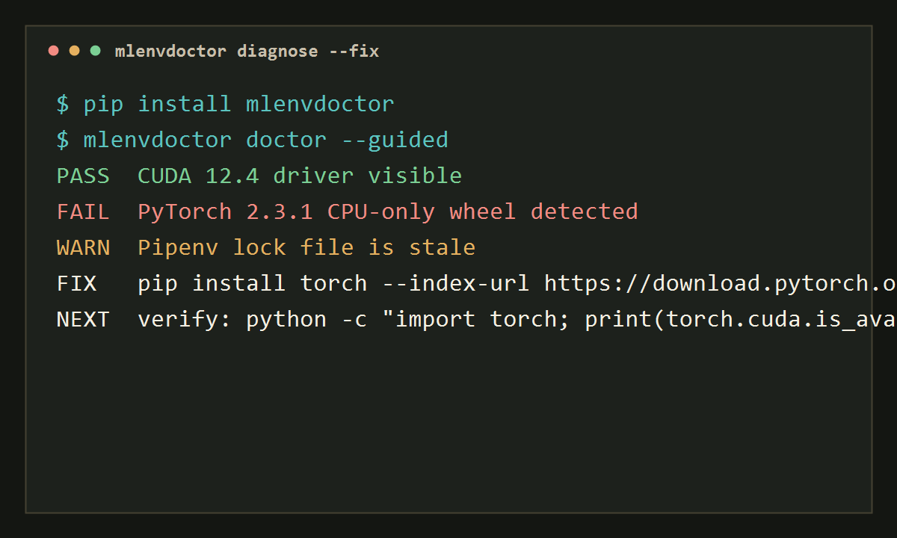

# ML Environment Doctor <small>v0.1.5</small>

<div class="hero-grid">
  <div class="hero-copy">
    <p><strong>Diagnose 47+ ML environment signals in about 12 seconds.</strong></p>
    <p>mlenvdoctor finds the boring, expensive failures behind PyTorch, CUDA, Conda, Pipenv, Docker, TensorFlow, JAX, and LLM fine-tuning stacks before they waste your training run.</p>

```bash
pip install mlenvdoctor
mlenvdoctor doctor --guided
```

  <p>
    <a class="md-button md-button--primary" href="quickstart/">Start diagnosing</a>
    <a class="md-button" href="checks/">View checks</a>
  </p>
  </div>
  <figure class="hero-terminal">
    
  </figure>
</div>

<div class="status-strip">
  <div class="status-pill"><span class="status-pass">PASS</span><br>CUDA driver visible</div>
  <div class="status-pill"><span class="status-fail">FAIL</span><br>PyTorch CUDA mismatch</div>
  <div class="status-pill"><span class="status-warn">WARN</span><br>Pipenv lock is stale</div>
</div>

## Quickstart

```bash
pip install mlenvdoctor          # 1. Install
mlenvdoctor doctor --guided      # 2. Get the next best fix
mlenvdoctor report               # 3. Generate JSON + HTML evidence
```

## Why ML Engineers Use It

<div class="metric-grid">
  <div class="metric-card"><strong>47+</strong>diagnostic signals across runtime, GPU, packages, and containers</div>
  <div class="metric-card"><strong>12s</strong>typical fast triage for common local ML stacks</div>
  <div class="metric-card"><strong>1 cmd</strong>actionable next step from `mlenvdoctor doctor --guided`</div>
</div>

!!! info "Built for the real failure loop"
    The goal is not just to print red text. mlenvdoctor groups low-level evidence into root-cause guidance: what failed, why it probably failed, what to do next, and how to verify it.

## Common Workflows

| Task | Command |
| --- | --- |
| Beginner-friendly recovery | `mlenvdoctor doctor --guided` |
| Full diagnostic table | `mlenvdoctor diagnose --full` |
| Machine-readable CI output | `mlenvdoctor doctor --ci` |
| JSON, CSV, or HTML evidence | `mlenvdoctor diagnose --json issues.json --html issues.html` |
| Safe fix plan | `mlenvdoctor fix --plan` |
| Dockerfile for training | `mlenvdoctor dockerize tinyllama` |

[Read the quickstart](quickstart.md){ .md-button .md-button--primary }
